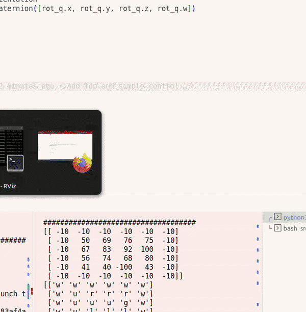
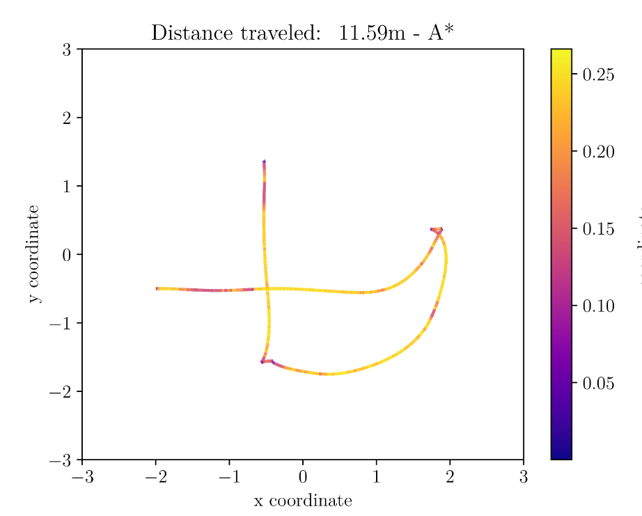

# IRobo - Projects

This repository contains the tasks from the "Introduction to robotics" course of the Instituto Sueprieor Técnico Lisboa. 
The goal is to learn fundamentals of robotics, while using ROS.

In this repository multiple approaches are implemented for localization, planning and controls.

__The final report can be read here: [Report](./docs/iRobo_Report.pdf)__

## Using the repository

This projects uses the [turtlebot3](https://www.turtlebot.com/turtlebot3/) platform. 


## Localization

```turtlebot3_scan_to_map```

In the scenario, the map is known and the robot receives a 2D LiDAR scan. 
A scan matching algorithm is implemented for korrekting the given EKF algrithm.


## Planning

```turtlebot3_send_nav_goals```

A node, which takes the GridMap and calculate random points as goal points for the 
control algorithm


```turtlebot3_markov_decision```

With a Markiv-Decision model a path is planned throught a known map with obstacles. 
We can self define rules for this algorithm to avoid regions and paths in that map.



## Utils

```turtlebot3_cmd_smoother```

Some pass-filter like smoothing for the control command on the real robot. This increased performance and accuracy

```turtlebot3_viz```

Visualization for EKF and PCL ground truth data.

```turtlebot3_custom```

Custom maps for more references in out data set for all algorithms

## Evaluation

In the evaluation, a scipt is used for extracting data from a ROS bag to write it into 
a json file.

This can then by visualized with matplotlib:



